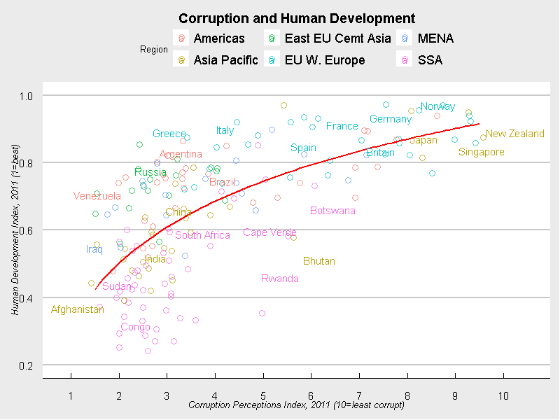

# Corruption Index Visualization Project

## Overview
This project recreates The Economist's 2011 "Corrosive Corruption" plot, visualizing the relationship between the Corruption Perceptions Index (CPI) and Human Development Index (HDI) using `ggplot2` in R. This analysis not only highlights regional differences in corruption but also examines how corruption impacts human development across various countries.

## Data Source
The dataset includes the CPI and HDI for multiple countries, categorized by regions. It was specifically prepared to mirror the analysis style of The Economist.

## Methodology
### Data Preparation
Data was imported and cleaned using the `data.table` package, ensuring it was ready for high-level visualization tasks.

### Visualization
- **Initial Plotting:** Data points are plotted on a scatter plot, colored by region to distinguish geographical variations.
- **Trend Analysis:** A logarithmic trend line is added to explore the relationship between CPI and HDI.
- **Enhancements:** Country-specific labels are added for select countries to provide deeper insights into specific cases.
- **Styling:** The plot is styled with `theme_economist_white` to mimic the aesthetic of The Economist's visualizations.

## Visualizations
The final visualization shows a scatter plot with a fitted trend line, colored data points by region, and annotated with country labels for selected nations. The plot includes custom axis labels and scales, a legend positioned at the top, and an R² annotation to indicate the fit of the regression model.

## Results
The visualization effectively demonstrates the inverse relationship between corruption perception and human development, highlighting countries that are outliers or follow the general trend.

## Comparison
Here is the [original plot by The Economist](https://www.economist.com/graphic-detail/2011/12/02/corrosive-corruption) from 2011:

And here is my recreation using `ggplot2`:

## Code
The R script is structured for easy replication of the analysis. Users can modify the code to extend the analysis to other years or datasets.

## How to Run
Ensure R is installed along with the `ggplot2`, `data.table`, and `ggthemes` packages. Clone this repository and run the script to reproduce the visualization.

## Authors
- Shaurya Sethi

## Acknowledgments
- The Economist for the inspiration behind the visualization style and theme.
